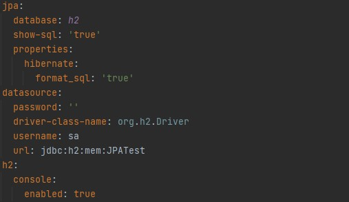
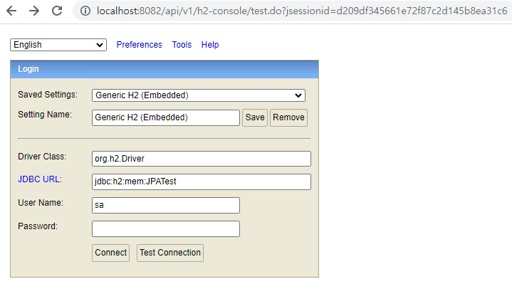

# H2 Database 사용법
## application.yml

## H2 Console 창

SpringBoot를 실행하면 그 안에 내장된 H2 Database가 실행된다.   
원래는 `localhost:8080/h2-console`로 접속하여 확인할 수 있다.   
나는 port 설정을 8082로, context-path를 /api/v1로 설정했기 때문에 접속 url이 `localhost:8082/api/v1/h2-console`이 되었다.   
application.yml에서 설정한 값과 H2 Console을 시작하는 창의 값이 같은 것을 볼 수 있다.   
나의 경우 처음에 JDBC URL이 `jdbc:h2:~/test`라고 되어있었다. 테스트하는 과정에서 수정한 듯.   
참고로 url이 잘못되면 Database not found가 발생한다.
   
+) 원래 데이터 베이스 정보는 별도의 파일 (ex - application-db.yml)에 작성해야하나, 연습용으로 남겨둔다.